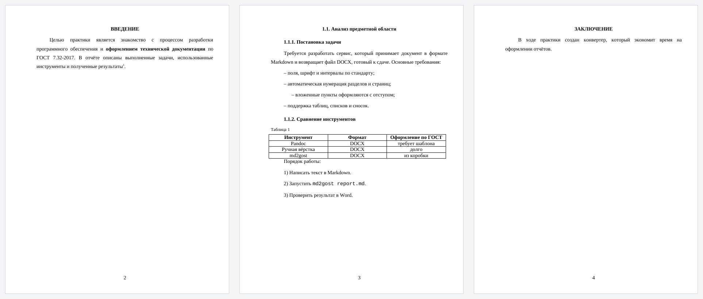

# My Converter Bot · md2gost

**Русский** · [English](README.en.md)

[](https://github.com/EDeev/my_converterbot/actions/workflows/ci.yml)
[](https://pypi.org/project/md2gost/)
[](https://pypi.org/project/md2gost/)
[](LICENSE)

Конвертер Markdown в DOCX по ГОСТ 7.32-2017 и Telegram-бот для учебной рутины: присылаешь `.md` —
получаешь отчёт, готовый к сдаче, присылаешь `.zip` с проектом — получаешь `.txt` с деревом папок и
содержимым файлов. Конвертер ставится отдельно, пакетом `md2gost` с PyPI.

**Статус:** личный проект, поддерживается · бот [@my_convbot](https://t.me/my_convbot) ·
пакет [md2gost](https://pypi.org/project/md2gost/)



**Стек:** Python 3.9+ · python-docx · aiogram 3 · Docker

## md2gost — Markdown → DOCX по ГОСТ

```bash
pip install md2gost
md2gost report.md                 # рядом появится report.docx
md2gost report.md -o out.docx --no-heading-numbers
```

Что делает с документом:

- поля: левое 30 мм, правое 15, верхнее и нижнее 20; Times New Roman 14 пт, интервал 1,5, абзацный отступ 1,25 см, выравнивание по ширине
- номера страниц внизу по центру, без номера на титульном листе
- нумерация разделов `1.`, `1.1.`, `1.1.1.`; «Введение», «Заключение», «Список литературы» и другие
  структурные элементы — без номера, прописными, по центру
- разрыв страницы перед каждым разделом второго уровня
- маркированные списки с тире и вложенностью, нумерованные — `1)`, своя нумерация у каждого списка
- таблицы с подписью «Таблица N» слева сверху, блоки и вставки кода моноширинным шрифтом, цитаты,
  сноски `[^1]`, жирный и курсив

Параметры командной строки: `--font`, `--size`, `--spacing`, `--no-heading-numbers`, `--no-page-numbers`,
`--number-title-page`. Из Python:

```python
from md2gost import DocumentSettings, MarkdownToDocxConverter

settings = DocumentSettings()
settings.auto_numbering_headings = True
MarkdownToDocxConverter(settings).convert("report.md", "report.docx")
```

Разбор Markdown свой и построчный: вложенные таблицы и списки внутри таблиц не поддерживаются.

## Бот

| Прислать | Получить |
|---|---|
| `.md` | `.docx` по ГОСТ (тот же md2gost с нумерацией заголовков) |
| `.zip` с проектом | `.txt`: дерево папок и содержимое текстовых файлов с номерами строк — удобно отдать в LLM или приложить к отчёту |

Файлы — до 20 МБ. Архив проверяется до распаковки: не больше 5000 файлов и 200 МБ в распакованном виде.
Служебные папки (`.git`, `node_modules`, `__pycache__`, `build`…) и бинарные файлы пропускаются.
Конвертация идёт в отдельном потоке, поэтому бот не замирает на больших файлах.

```bash
git clone https://github.com/EDeev/my_converterbot.git && cd my_converterbot
cp .env.example .env      # BOT_TOKEN от @BotFather
docker compose up -d
```

Готовый образ: `docker pull ghcr.io/edeev/my_converterbot` или `docker pull dcr.deev.su/edeev/my_converterbot`.
Без Docker: `pip install -r requirements.txt`, затем `BOT_TOKEN=… python bot.py`.

`rep_to_txt.py` работает и сам по себе: `python rep_to_txt.py путь/к/проекту`.

## Структура

```
md2gost/converter.py   конвертер: настройки DocumentSettings и MarkdownToDocxConverter
md2gost/cli.py         командная строка md2gost
bot.py                 Telegram-бот
rep_to_txt.py          дерево проекта и содержимое файлов в один .txt
tests/                 тесты конвертера и бота
```

## Разработка

```bash
pip install -r requirements-dev.txt
ruff check --select E9,F,B . && pytest
```

CI проверяет пакет на Python 3.9, 3.12 и 3.13 и собирает его. По тегу `v*` пакет публикуется на PyPI, а
Docker-образ бота — в GitHub Packages и `dcr.deev.su`.

## Лицензия

MIT — см. [LICENSE](LICENSE).

## Автор

**Деев Егор Викторович** — [GitHub](https://github.com/EDeev) · [Telegram](https://t.me/DeevEgor) · [egor@deev.space](mailto:egor@deev.space)

---

<div align="center">
  <sub>⭐ Если проект оказался полезным, поставьте звёздочку на GitHub!</sub>
  <p><sub>Сделано с ❤️ — <a href="https://deev.space">deev.space</a></sub></p>
</div>
